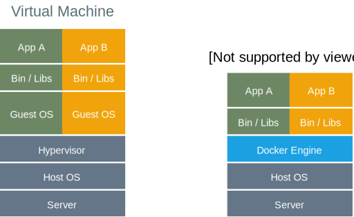

<style type="text/css">
  .reveal {
   font-size: 30px;
  }
  .reveal p {
    text-align: left;
  }
  .reveal ul {
    display: block;
  }
  .reveal ol {
    display: block;
  }
  img {
   display: block ! important;
   width: auto ! important;
   margin: auto ! important;
   border: 0 ! important;
   box-shadow: none ! important;
  }
</style>
---
# Docker Container und Virtualisierung

---
## Am Ende dieses Moduls ...
 
... verstehen Sie den Unterschied zwischen einem Container und einer virtuellen Maschine.

... kennen Sie die Vorteile eines Containers.

... sind Sie in der Lage die Docker Kommandozeile zu verwenden.

... können Sie eigene Docker Images und Container erzeugen.

---
## Was ist ein Container?

---
## „Containerization“ in den 60er Jahren
* Bessere Platznutzung (genormte Maße, stapelbar)
* Höhere Transportsicherheit (Beschädigung, Diebstahl)
* Effizientere Be- und Entladung sowie Transport
* Geschlossene Transportkette (Land, See)


---
## Was ist ein Docker Container?
Ein Container ist ein **standardisiertes** Paket, das die Softwareanwendungen mit allen Abhängigkeiten (Laufzeiten, System Tools, Bibliotheken, ..) 
**portabel** und **isoliert** verpackt.

Dadurch können Anwendungen schnell, einfach und **reproduzierbar** auf unterschiedlichen Systemen ausgeführt werden.


---
## „Containerization“ in den 2010er Jahren


|Transportcontainer|Docker Container|
|---|---|
|"Bessere Platznutzung"|Platzersparnis durch Verzicht auf ein komplettes Betriebssystem|
|"Höhere Transportsicherheit"|Isolation des Containers zu anderen Prozessen|
|"Effizientere Be- und Entladung sowie Transport"|Standardisierter Deploymentprozess unterstützt durch effiziente Tools|
|"Geschlossene Transportkette"|Gewisse Unabhängigkeit von Betriebssystem & Cloudanbieter|

---

## Virtuelle Maschine vs. Docker Container


||VM|Container|
|--:|---|---|
|Grundlage:| Hardware Virtualisierung | Isolation (Prozesse, Dateisystem, Rechte, ..)|
|Gastsystem:| eigener Kernel | Kernel des Hostsystems wird mitverwendet |

---
## Docker Isolation
Docker nutzt Features des Linuxkernels zur Isolation:
* **cgroups**: Allokation von Rechenleistung und Bandbreite (zB. CPU, RAM, Datei- und Netzwerkzugriff)
* **namespaces**: Isolation von Prozessen, Nutzern, Files, usw.

und weitere ...


---
## Vorteile von Containertechnologie
Containerbasierte Anwendungen haben ...
* ... ein **identisches Verhalten** auf unterschiedlichen Systemen.
* ... einen **geringeren Ressourcenverbrauch** gegenüber VMs (Speicherplatz, RAM, CPU).
* ... eine **signifikant schnellere Startzeit** gegenüber VMs.

---
## Demo: Container Starten

`docker run hello-world`

---
## Docker Befehle: Container
|Befehl|Beschreibung|
|---|---|
|`docker run <image>`| Startet einen neuen Container auf Basis des angegebenen Docker Images. Unterstützt weitere Parameter z.B. Portfreigabe `docker run -d -p 80:8000 crccheck/hello-world`.|
|`docker ps [-a]`| Zeigt alle laufenden Container (-a auch die bereits gestoppten)|
|`docker start <container>`| Startet einen bereits existierenden/gestoppten Container|
|`docker stop <container>`| Stoppt einen laufenden Container|
|`docker rm <container>`| Entfernt einen Container|

---
## Docker Images & Container


||||
|--:|---|:--|
|Docker Container|≙|gestartete Instanz eines Images|
|Docker Image|≙|Bauplan bzw. Datenbasis eines Containers|

---
## Übung 1: Docker Basics

---
## Docker Registry

Docker Images werden in einer Registry verwaltet:

* Standardmäßig verbindet sich ihr Docker Client mit der **offiziellen Registry**: [**http://hub.docker.com**](https://hub.docker.com/)
* Es ist allerdings auch möglich eine **eigene Registry** zu betreiben: [registry image](https://hub.docker.com/r/_/registry/).

* .. und es existieren verschiedene *komerzielle Angebote*:
	* [Google Cloud Container Registry](https://cloud.google.com/container-registry/)
	* [Amazon Elastic Container Registry](https://aws.amazon.com/de/ecr/)

---
## Docker Images
Ein Docker Image werden durch ein sog. **Dockerfile** definiert. 

Beispiel:

```
FROM alpine:latest

COPY ./hello.sh /hello.sh

RUN chmod 755 /hello.sh

CMD ["sh", "hello.sh"]
```

* **FROM** Beschreibt das Basisimage auf das aufgebaut wird.
* **COPY** Kopiert eine File/einen Ordner in das Image.
* **RUN** Führt einen Befehl innerhalb des Images während des Bauvorgangs aus.
* **CMD** Beschreibt den Standard-Einstiegspunkt in die Anwendung.

---
## Demo Docker Image

Note:
* mkdir myimage
* cd myimage
* neue Datei: Dockerfile, Inhalt aus Slide
* neue Datei: hello.sh, Inhalt: echo "hello world"
* docker build . -t myimage
* docker run myimage

---

## Docker Images #2

* **Bauen des Image** 
	```
	docker build . -t myimage
	```


* **Optional: Publizieren auf der Registry**


* **Ausführen als Containers**


---
## Übung 2: Docker Images

---
## Docker Portfreigaben
* Docker wird in der modernen Cloudentwicklung eingesetzt um **Webanwendung** (*"Microservices"*) als **Container** zu paketieren.

* Aus Sicherheitsgründen werden **per default keine Ports** aus den Containern an das Host System **freigegeben**.

* Portfreigaben müssen **explizit** beim `run` Befehl angegeben werden: 
```
docker run -p HOST_PORT:CONTAINER_PORT` 
```
	

* Demo:  
 ```
 # -d steht für *detached* bzw. Ausführung im Hintergrund
 docker run -d -p 80:80 rancher/hello-world 
 ```

---
## Docker Volumes

* Beim entfernen eines Containers gehen alle Daten in diesem verloren.
* Das ist natürlich keine Option für Anwendungen die *stateful* sind. Beispiel: Datenbanksysteme.
* Für solche Szenarien gibt es Docker Volumes. Mit diesen können Dateipfade des Hostsystems in das Dateisystem des Containers eingehängt werden. Somit überdauern diese den Containerlifecycle.
* Demo: 
```
docker run -d -v /my/folder:/web -p 8080:8080 halverneus/static-file-server:latest
```

---
## Übung 3: Docker Images - Ports & Volumes

---
## Zusammenfassung & Ausblick
* Docker Container sind leichtgewichtiger als virtuelle Maschinen, bringen trotzdem viele Ihrer Vorteile mit.
* Docker Container sind die Basis der *modernen Anwendungsentwicklung* in der *Cloud*.
* Um Serverressourcen möglichst effizient zu Nutzen sollten Container entsprechend der Auslastung möglichst effizient auf einem Servercluster verteilt werden. Sog *Container-Orchestration-Systeme* wie Kubernetes, Mesos, Docker Swarm helfen einem dabei.

---
## End